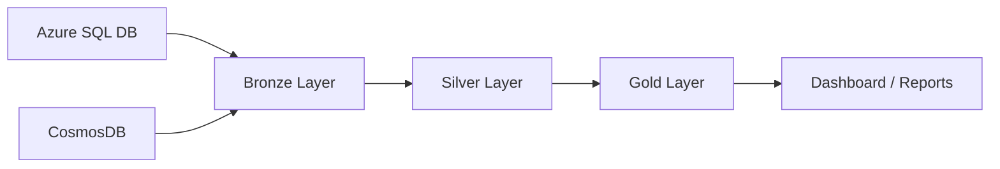
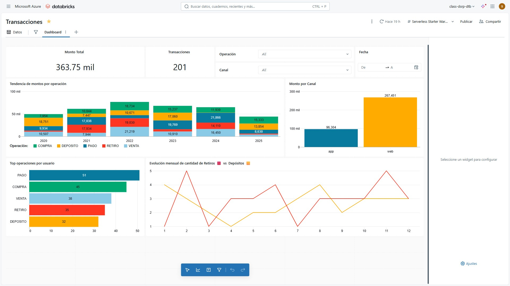

# 🚀 Data Lakehouse Pipeline con Databricks (Bronze → Silver → Gold)

## 📌 Objetivo
Implementar un pipeline de datos en **Azure Databricks** siguiendo la arquitectura **medallion (Bronze, Silver, Gold)** para centralizar, limpiar y transformar transacciones financieras provenientes de múltiples fuentes, y generar métricas analíticas para reportes y dashboards.

---

## 🏗️ Arquitectura del Proyecto

- **Bronze:** ingesta de datos crudos desde Azure SQL y CosmosDB.  
- **Silver:** unificación, limpieza, estandarización y deduplicación.  
- **Gold:** agregaciones analíticas (KPIs) para consumo en dashboards.  

---

## 🔧 Tecnologías Utilizadas
- **Azure SQL Database** (origen relacional)  
- **CosmosDB** (origen NoSQL, JSON)  
- **Azure Databricks** (PySpark, Delta Lake)  
- **Azure Data Lake Storage (ADLS)**  
- **Power BI / Databricks SQL** (visualización)  

---

## 📂 Pipeline Detallado

### 1. Capa Bronze – Ingesta
- Conexión JDBC a **Azure SQL** para leer tabla `transacciones`.  
- Conector oficial de **CosmosDB para Spark** para leer documentos JSON.  
- Datos guardados en tablas Delta en la capa **Bronze**.  

📄 Notebook Ingesta desde Azure SQL: [`01_bronze_sql_web.ipynb`](./notebooks/01_bronze_sql_web.ipynb)  
📄 Notebook Ingesta desde CosmosDB: [`01_bronze_cosmos_app.ipynb`](./notebooks/01_bronze_cosmos_app.ipynb)  

---

### 2. Capa Silver – Maestra de Transacciones
- Unión de ambas fuentes (SQL y CosmosDB).  
- Agregado campo `canal` (`WEB` o `APP`).  
- Conversión de tipos (`monto → DOUBLE`, `fecha/hora → TIMESTAMP`).  
- Eliminación de duplicados.  
- Resultado: tabla **`silver_transacciones`**.  

📄 Notebook: [`02_silver_master.ipynb`](./notebooks/02_silver_master.ipynb)  

---

### 3. Capa Gold – Agregaciones Analíticas
- Métricas calculadas por: canal, operación, año, mes.  
  - **Cantidad:** `COUNT(*)`  
  - **Monto total:** `SUM(monto)`  
  - **Monto promedio:** `AVG(monto)`  
  - **Mínimo / Máximo:** `MIN/MAX(monto)`  
- Resultado: tabla **`gold_transacciones_agg`**.  

📄 Notebook: [`03_gold_analytics.ipynb`](./notebooks/03_gold_analytics.ipynb)  

---

### 4. Dashboard
- Tendencia de montos por operación.  
- Comparación entre canales (**WEB vs APP**).  
- Top operaciones por usuario.  
- Evolución mensual de depósitos y retiros.  

📊 Capturas:  
  

---

## 📈 Resultados
- Pipeline automatizado en Databricks con arquitectura medallion.  
- Tablas optimizadas en **Delta Lake** listas para consultas analíticas.  
- Dashboard interactivo que resume el comportamiento de transacciones.  

---

## 🚀 Próximos pasos
- Incorporar **ingesta en tiempo real** con Structured Streaming.  
- Implementar **pruebas unitarias de datos** (Great Expectations).  
- Publicar métricas en un panel de **Power BI** conectado en vivo a Gold.  

---

👨‍💻 Autor: [Jhossy Vargas Saldaña](https://www.linkedin.com/in/jhossyvargas)  
